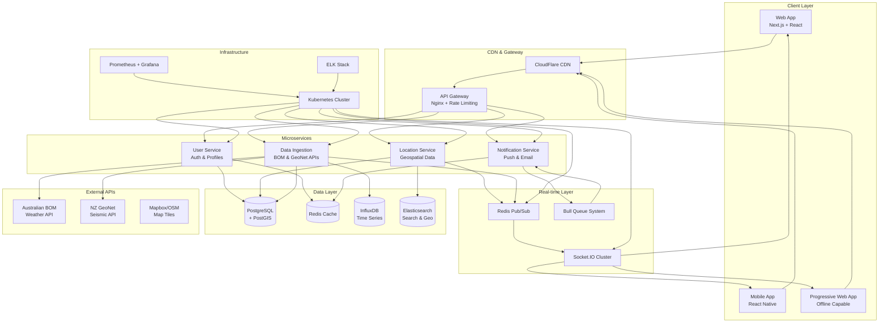
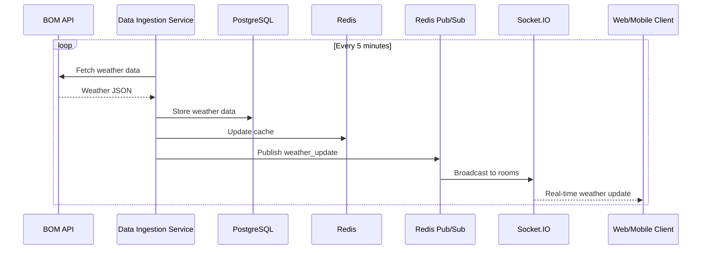
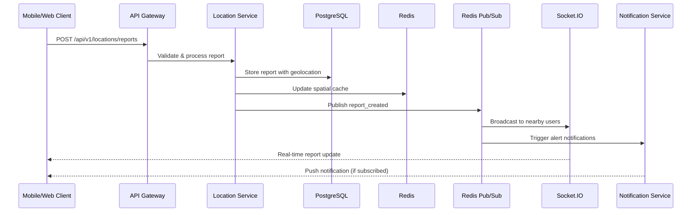
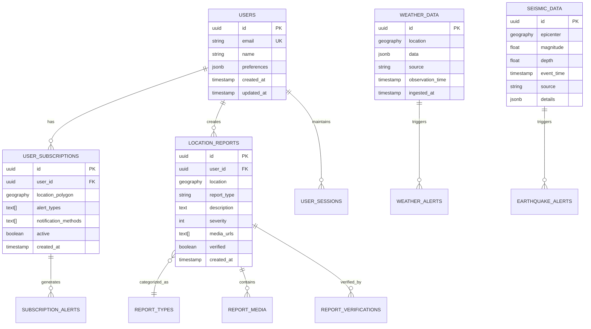
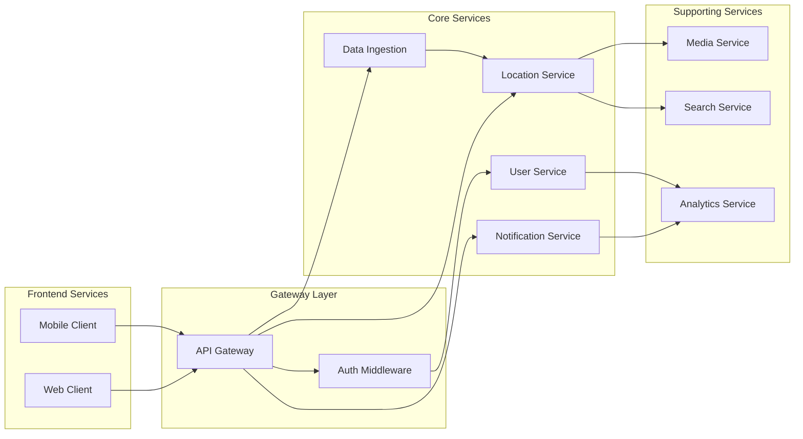
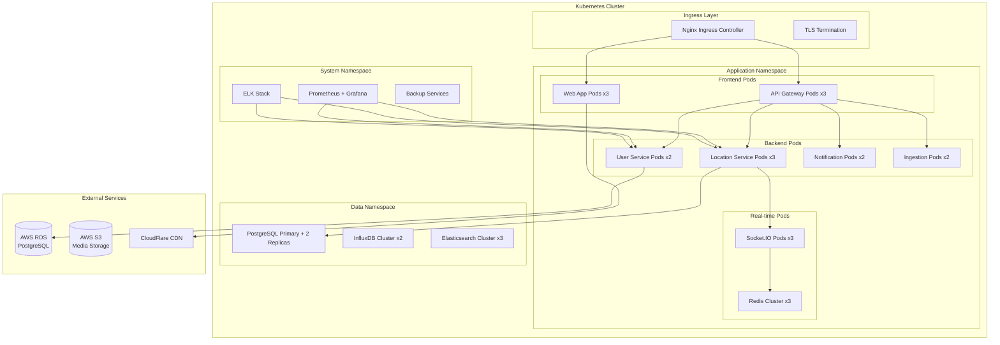
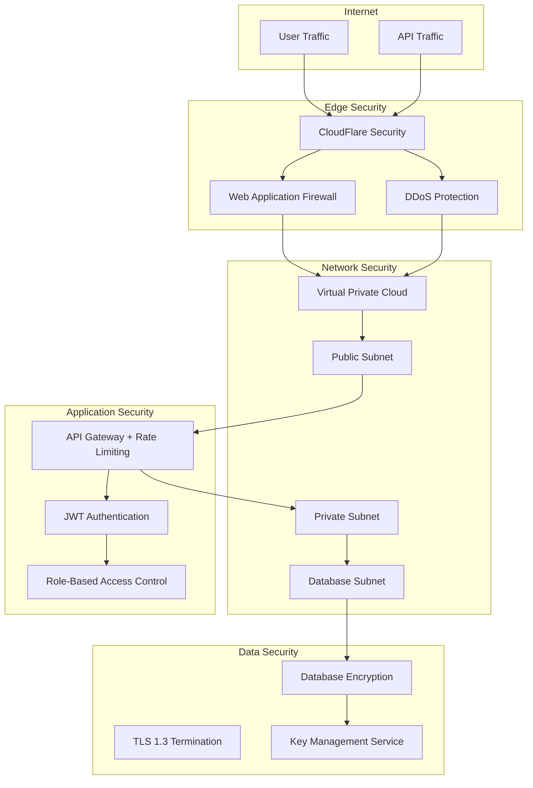
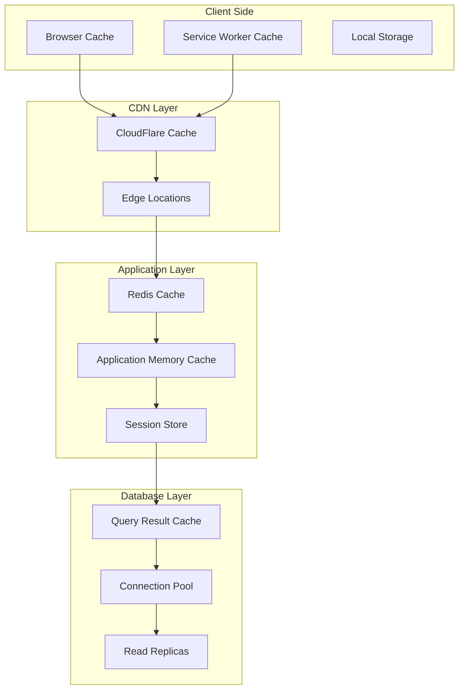

# System Design Diagrams - Live Conditions App

## High-Level System Architecture

## Data Flow Architecture

### Real-time Weather Data Flow

### User Report Submission Flow

## Database Schema Design

### Core Entity Relationships

## Microservices Communication

### Service Dependencies

## Deployment Architecture

### Kubernetes Cluster Layout

## Network Security Architecture

### Security Layers

## Performance Optimization Strategy

### Caching Layers

This comprehensive system design provides visual representations of the architecture components, data flows, and infrastructure layout for the Live Conditions application. Each diagram serves as a blueprint for implementation teams to understand the system's complexity and interconnections.